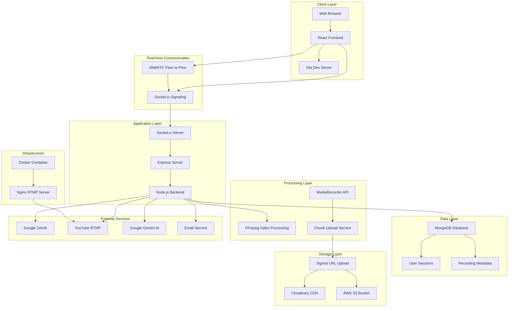
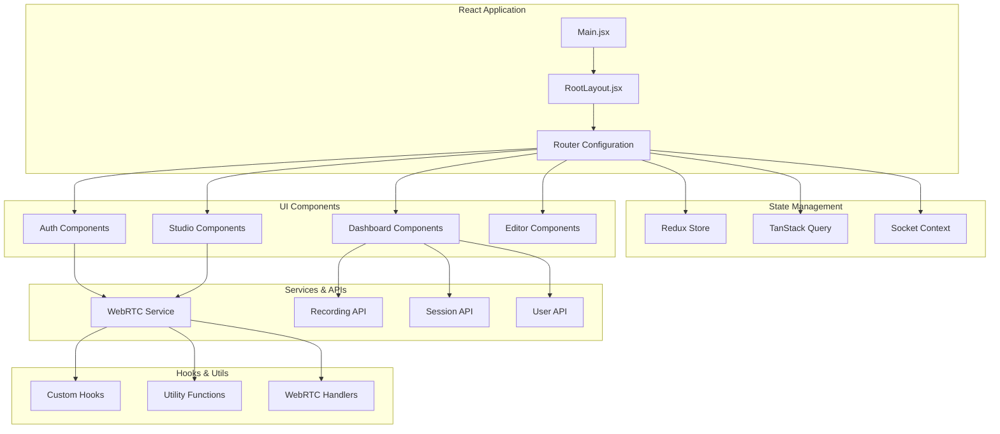
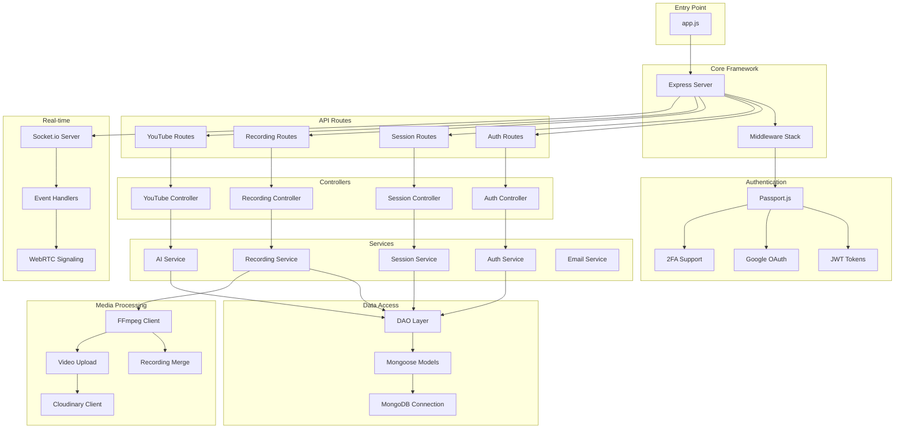
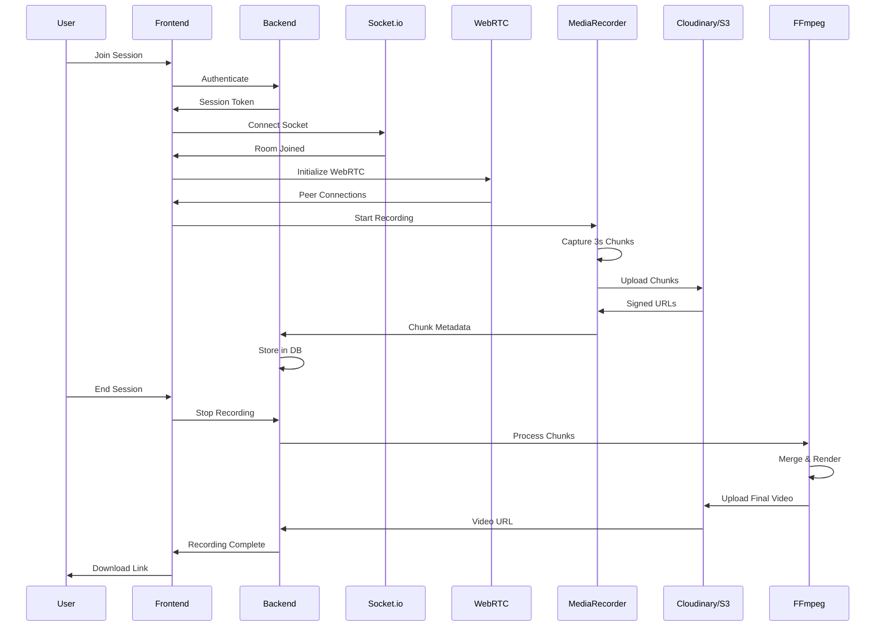
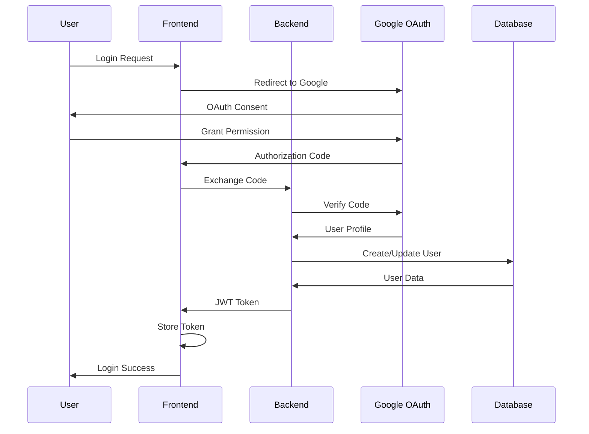
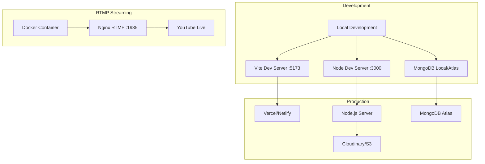
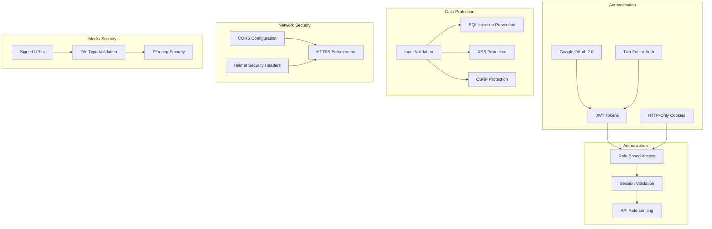
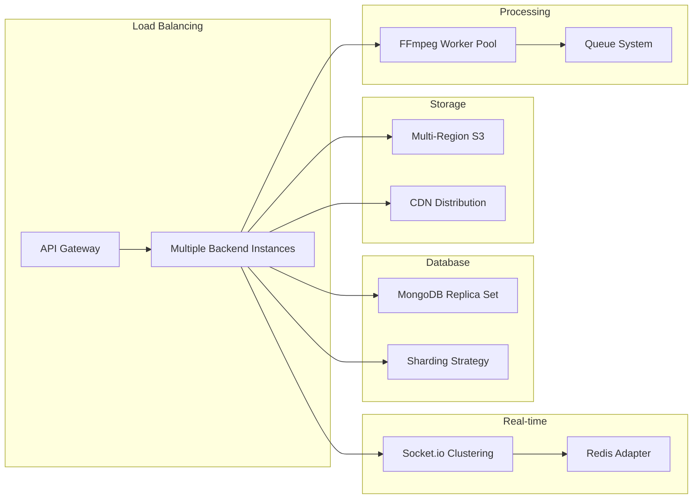

<div align="center">

  <h1>🎙️ FinalCast</h1>
  
  <h3>Not Just Record — Record. Render. Release.</h3>
  <p><i>FinalCast is an open-source, full-stack podcasting and video conversation platform built with the MERN stack, WebRTC, and FFmpeg — designed to provide creators with a fully rendered video after every session, without needing to manually edit timeline chunks.</i></p>


---
  <p>
    <a href="#-tech-stack">Tech Stack</a> •
    <a href="#-core-features">Features</a> •
    <a href="#-getting-started">Getting Started</a> •
    <a href="#-architecture">Architecture</a>
  </p>


  
  
[](https://opensource.org/licenses/MIT)
[](https://github.com/anothercoder-nik/FinalCast-OpenSource)

[](CONTRIBUTING.md)
[](https://nodejs.org/)
[](https://reactjs.org/)
[](https://expressjs.com/)
[](https://www.mongodb.com/)

</div>

---

## 🚀 Why FinalCast?

Traditional streaming tools often leave you with a mess of raw footage. **FinalCast** is different. We are building a platform that doesn't just record; it **produces**.

By leveraging **WebRTC** for real-time interaction and **FFmpeg** for server-side compositing, FinalCast delivers a fully rendered, editor-ready video immediately after your session ends. No more manual stitching. No more syncing headaches.

> **Our Mission:** To democratize professional-grade live broadcasting by combining the flexibility of the web with the power of server-side rendering.

---

## 🛠️ Tech Stack

### Trusted by Engineers, Built for Creators.

#### **Frontend (The Stage)**


*   **State & Async:** `TanStack Query`, `Redux Toolkit`
*   **Real-time:** `Socket.io-client` for signaling
*   **Styling:** `Tailwind CSS` + `Radix UI` Primitives
*   **Animations:** `Framer Motion`


# 🏗️ FinalCast Architecture Diagram

## System Overview

FinalCast is a full-stack podcasting and video conversation platform that provides real-time recording, server-side rendering, and automated video production. The system combines WebRTC for real-time communication with FFmpeg for professional video processing.

## High-Level Architecture



## Detailed Component Architecture

### Frontend Architecture



### Backend Architecture



## Data Flow Architecture

### Recording Workflow



### Authentication Flow



## Deployment Architecture



## Security Architecture



## Performance Considerations

- **WebRTC Mesh Topology**: Direct peer-to-peer connections for low latency
- **Progressive Upload**: 3-second chunks with resume capability
- **CDN Integration**: Cloudinary for global content delivery
- **Database Indexing**: Optimized queries for session and recording data
- **Caching Strategy**: Redis for session storage (planned)
- **Compression**: Video transcoding with FFmpeg for optimal file sizes

## Scalability Architecture



This architecture diagram provides a comprehensive view of FinalCast's system design, showing how all components interact to deliver a seamless recording and video production experience.
#### **Backend (The Studio)**


*   **Core:** `Node.js` + `Express`
*   **Media Processing:** `FFmpeg` (Server-side rendering & transcoding)
*   **Storage:** `AWS S3` (via Multer S3) & `Cloudinary`
*   **Auth:** `Passport.js` (Google OAuth) + `JWT`
*   **AI Integration:** `@google/generative-ai`

---

## 🎯 Core Features

| Feature | Description |
| :--- | :--- |
| **🔴 Real-time Studio** | Low-latency video calls powered by **WebRTC** and mesh networking. |
| **🎞️ Cloud Rendering** | Automatic, server-side composition of video tracks using **FFmpeg**. |
| **🤖 AI-Enhanced** | Integrated with **Google Gemini** for smart features. |
| **📁 Smart Storage** | Multipart uploads to **AWS S3** with robust failure recovery. |
| **🎼 Dynamic Layouts** | Auto-adjusting video grids that adapt as participants join. |
| **🔐 Secure Access** | `OAuth2` Google login and `JWT` session management. |
| **📡Peer-to-peer** | Peer-to=peer media exchange with fallback signaling. |
| **🎙️ Multi-participant** |  Auto layout (dynamic tiling) |
| **🪄 Visual Timeline Editor** |  Drag-and-drop layout available. | 

---

## 📂 Architecture & Folder Structure

We maintain a clean separation of concerns between the client and server.

```bash
FinalCast/
├── frontend/               # The Client Application
│   ├── src/
│   │   ├── api/            # API integration points
│   │   ├── components/     # Reusable UI components
│   │   ├── context/        # React Context providers
│   │   ├── hooks/          # Custom Hooks (useWebRTC, etc.)
│   │   ├── pages/          # Application Routes/Pages
│   │   ├── store/          # Redux State Management
│   │   └── utils/          # Helper functions
│   └── package.json
│
├── backend/                # The Server Application
│   ├── DAO/                # Data Access Objects (DB Layer)
│   ├── config/             # Environment & App Configuration
│   ├── controllers/        # Request Handlers
│   ├── models/             # Mongoose Schemas
│   ├── routes/             # API Route Definitions
│   ├── services/           # Business Logic (Recording, Transcoding)
│   ├── socket/             # Real-time Event Handlers
│   ├── recording/          # Media Processing Utilities
│   └── app.js              # Server Entry Point
│
└── README.md
```

---

## ⚡ Getting Started

Ready to run your own studio? Follow these steps.

### Prerequisites
*   Node.js (v18+)
*   MongoDB (Local or Atlas)
*   FFmpeg installed on your system path.

### Installation

1.  **Clone the repository**
    ```bash
    git clone https://github.com/anothercoder-nik/FinalCast.git
    cd FinalCast
    ```

2.  **Setup Backend**
    ```bash
    cd backend
    npm install
    # Create .env file based on .env.example
    npm run dev
    ```

3.  **Setup Frontend**
    ```bash
    cd ../frontend
    npm install
    npm run dev
    ```

4.  **Go Live!**
    Visit `http://localhost:5173` and start creating.

---

## 🤝 Contributing

We love contributions! FinalCast is built by the community, for the community.

1.  Check out our [Open Issues](./OPEN_ISSUES.md) to find a task.
2.  Fork the repo and create a branch: `git checkout -b feature/amazing-feature`.
3.  Commit your changes and push.
4.  Open a Pull Request! 🚀

---

<p align="center">
  Built with ❤️ by the FinalCast Team
</p>
